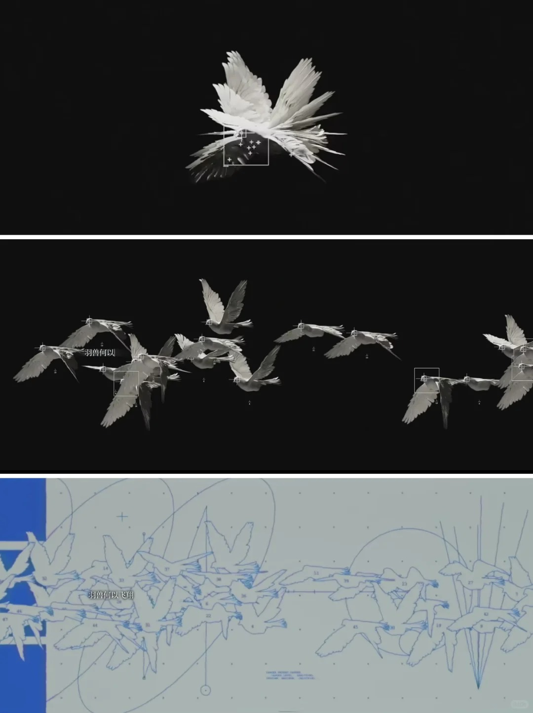
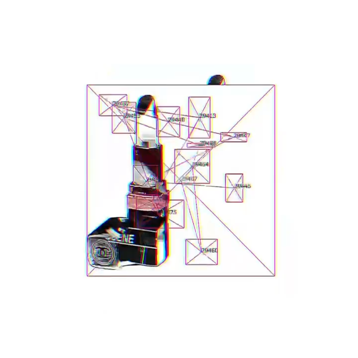

# Quiz 8: Design Research

## Part 1: Imaging Technique Inspiration

I'm inspired by **Blob Tracking**, a computer vision technique that isolates moving "blobs" or masses of pixels in a video feed. This is often used to track objects in real-time and represent them with dynamic outlines. I want to apply this **"organic line tracing"** to Mohamedi's work. Instead of static lines, the composition will be formed by a group of interconnected, fluid "blobs." Their outlines will dynamically change and shift, creating a mesmerizing, ever-changing composition that respects her linear precision while making the artwork appear alive and responsive, as if breathing.

## Part 2: Coding Technique Exploration

I will use **Perlin noise to animate the vertices of geometric shapes**. Instead of manually creating a complex blob, I'll draw a basic shape like a circle or polygon. Then, for each vertex of that shape, I'll use a Perlin noise value to subtly displace its position. This gives the shape a fluid, organic, and ever-changing outline. By linking multiple shapes together, I can create the effect of a larger, interconnected "blob" system. The noise function provides a smooth, pseudo-random motion, making the abstract forms appear to flow and undulate like living organisms.

Link to the coding: 
[perlin noise](https://p5js.org/examples/repetition-noise/)
[blob track](https://openprocessing.org/sketch/2546873)